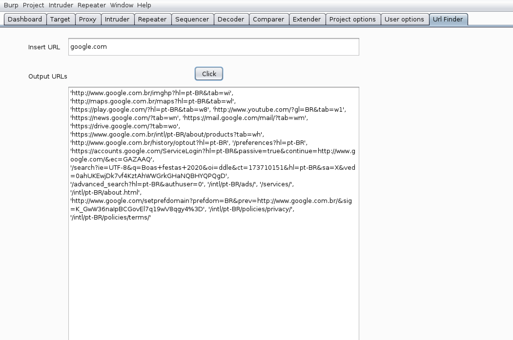

# url-finder
UrlFinder is a Burpsuite extension for request/response body,to get all URLs from code, writing in Jython 2.7.

### Installation
Install from BApp:
1. Visit [Jython Offical Site](https://www.jython.org/download), and download Jython Standalone jar file.
2. Open Burpsuite, goto Extender -> Options -> Python Environment, set the Location of Jython Jar. And go to Extender -> BApp Store, find Burp Beautifier and install it.

Manual Install:
1. Visit [Jython Offical Site](https://www.jython.org/download), and download Jython Installer.
2. Open Jython Installer to install Jython(In standard mode, make sure it will install pip). Assume it has be installed in `C:\jython2.7.2` directory.
3. Install Jython modules: `C:\jython2.7.2\bin\jython.exe -m pip install -r requirements.txt` or Jython.jar : 

  `java -jar jython-standalone-2.7.2.jar -m ensurepip`  

  `java -jar jython-standalone-2.7.2.jar -m pip install requests`

  `java -jar jython-standalone-2.7.2.jar -m pip install beautifulsoup4`

4. Open Burpsuite, go to Extender -> Options -> Python Environment, set the Location of Jython Jar is `C:\jython2.7.2\jython.jar`, and the Folder for loading modules is `C:\jython2.7.2`.
5. Download this tool, Open Burpsuite, go to Extender -> Extensions -> Add -> Choose the beautifier.py.

### Screenshot

### How to use
1. Write the website that you want to send the request
2. Click on button "Click"
3. Wait and see all URLs from this Website
